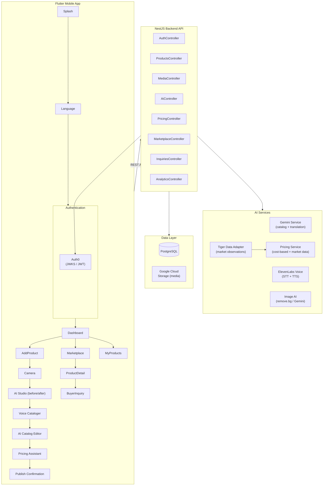
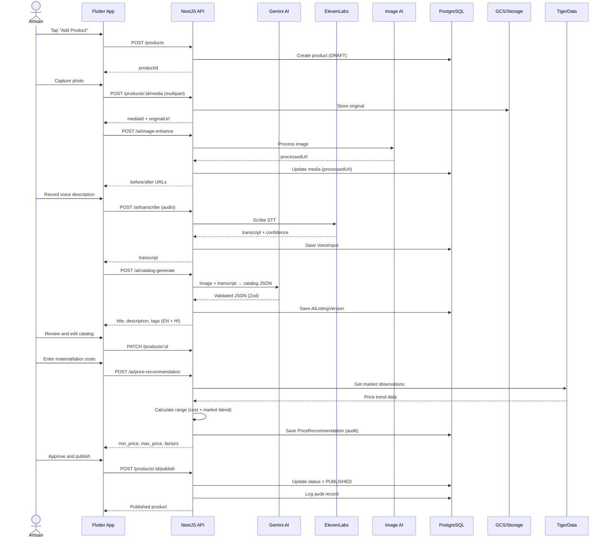

```mermaid
graph TB
    subgraph Mobile["Flutter Mobile App"]
        Splash --> Language
        Language --> Auth
        Auth --> Dashboard
        Dashboard --> AddProduct
        Dashboard --> Marketplace
        Dashboard --> MyProducts
        AddProduct --> Camera
        Camera --> AIStudio["AI Studio (before/after)"]
        AIStudio --> VoiceCataloger["Voice Cataloger"]
        VoiceCataloger --> CatalogEditor["AI Catalog Editor"]
        CatalogEditor --> PricingAssistant["Pricing Assistant"]
        PricingAssistant --> PublishConfirm["Publish Confirmation"]
        Marketplace --> ProductDetail
        ProductDetail --> BuyerInquiry
    end

    subgraph Backend["NestJS Backend API"]
        AuthController
        ProductsController
        MediaController
        AiController
        PricingController
        MarketplaceController
        InquiriesController
        AnalyticsController
    end

    subgraph AIServices["AI Services"]
        GeminiService["Gemini Service\n(catalog + translation)"]
        VoiceService["ElevenLabs Voice\n(STT + TTS)"]
        ImageAiService["Image AI\n(remove.bg / Gemini)"]
        PricingService["Pricing Service\n(cost-based + market data)"]
        TigerDataAdapter["Tiger Data Adapter\n(market observations)"]
    end

    subgraph Storage["Data Layer"]
        PostgreSQL[(PostgreSQL)]
        GCS["Google Cloud\nStorage (media)"]
    end

    Mobile -->|REST API| Backend
    Backend --> AIServices
    Backend --> Storage
    TigerDataAdapter --> PricingService
    
    subgraph Auth["Authentication"]
        Auth0["Auth0\n(JWKS / JWT)"]
    end

    Backend --> Auth0
```

## Data Flow: Product Creation

```mermaid
sequenceDiagram
    actor Artisan
    participant App as Flutter App
    participant API as NestJS API
    participant Gemini as Gemini AI
    participant EL as ElevenLabs
    participant ImageAI as Image AI
    participant DB as PostgreSQL
    participant Storage as GCS/Storage

    Artisan->>App: Tap "Add Product"
    App->>API: POST /products
    API->>DB: Create product (DRAFT)
    API-->>App: productId

    Artisan->>App: Capture photo
    App->>API: POST /products/:id/media (multipart)
    API->>Storage: Store original
    API-->>App: mediaId + originalUrl

    App->>API: POST /ai/image-enhance
    API->>ImageAI: Process image
    ImageAI-->>API: processedUrl
    API->>DB: Update media (processedUrl)
    API-->>App: before/after URLs

    Artisan->>App: Record voice description
    App->>API: POST /ai/transcribe (audio)
    API->>EL: Scribe STT
    EL-->>API: transcript + confidence
    API->>DB: Save VoiceInput
    API-->>App: transcript

    App->>API: POST /ai/catalog-generate
    API->>Gemini: Image + transcript → catalog JSON
    Gemini-->>API: Validated JSON (Zod)
    API->>DB: Save AIListingVersion
    API-->>App: title, description, tags (EN + HI)

    Artisan->>App: Review and edit catalog
    App->>API: PATCH /products/:id

    Artisan->>App: Enter material/labor costs
    App->>API: POST /ai/price-recommendation
    API->>TigerData: Get market observations
    TigerData-->>API: Price trend data
    API->>API: Calculate range (cost + market blend)
    API->>DB: Save PriceRecommendation (audit)
    API-->>App: min_price, max_price, factors

    Artisan->>App: Approve and publish
    App->>API: POST /products/:id/publish
    API->>DB: Update status = PUBLISHED
    API->>DB: Log audit record
    API-->>App: Published product
```
